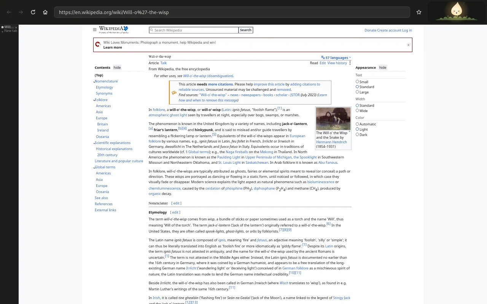

<div align="center">

# Slipstream

**The Linux desktop the movies promised.**

Apps that transfer to digital rain. Wallpapers that come alive the moment you walk away.<br>
Nothing that interrupts you. Nothing that ever leaves your machine.

[](https://github.com/peterwalker78/slipstream-desktop/actions/workflows/ci.yml)
[](https://github.com/peterwalker78/slipstream-desktop/releases)
[](LICENSE)


<sub>Recorded from Slipstream itself: the desktop fading into its living wallpaper, and one key bringing it back.</sub>

[**Get it**](#get-slipstream) · [**Why**](#why-slipstream-exists) · [**Glimmerwood**](#the-other-half-glimmerwood) · [**Every key**](guide/keys.md) · [**Help**](guide/help.md)

</div>

## Why Slipstream exists

Movies always made computers look better than what big tech has delivered. Screens of falling green code, one key that does something enormous, someone who clearly knows exactly what they're doing. Then you sit down at a real computer, and there's a taskbar.

**And everything on that screen is competing for you.** Infinite feeds, red badges, autoplay, notifications timed to pull you back the moment you settle into something that matters. It has quietly trained all of us to check one thing and lose an hour.

**So Slipstream is the other kind of computer: a workshop, not a slot machine.** Good-looking enough that you want to sit down at it. Quiet enough that you get lost in the work instead of the machine. Everything a keystroke away - which is the part the movies genuinely got right, because the people who look like wizards on screen are just people who never reach for the mouse.

Free, open source, and yours to keep. It installs **beside** the desktop you already use, so trying it costs you nothing: pick Slipstream at the login screen, and go back whenever you like.

## Your wallpaper is alive

<table>
<tr>
<td align="center"><br><b>Galaxies</b><br><sub>Two galaxies collide, then the collision runs backwards.</sub></td>
<td align="center"><br><b>Physarum</b><br><sub>A slime mould creeps out over the screen in amber veins.</sub></td>
<td align="center"><br><b>Life</b><br><sub>Conway's Game of Life, glowing and swirling to a beat.</sub></td>
</tr>
</table>

Step away from your desk and the desktop dissolves and hands over the screen. There's no screensaver waiting to kick in - the wallpaper was running behind your windows the whole time.

**There are twenty, and most of them aren't animations at all.** They're worked out live as you watch, so they never run quite the same way twice. Touch any key and your work comes straight back, exactly as you left it.

[**All twenty →**](guide/wallpapers.md)

## Windows fall into the Matrix


Put a window away and it doesn't disappear into a bar along the bottom. It pours down the side of the screen as a stream of falling green code, and carries on running there.

**The rain is a readout.** A busy app races, bright green. A quiet one drifts down slowly in grey. So a build finishing, or a tab running away with itself, catches your eye without you going to look for it.

**Pop-ups you never asked for are sent there too.** An app that opens a window by itself, or throws one in front of you while you're typing, pours straight into the rain instead of taking the screen, with a quiet toast to say what happened. Windows you opened yourself, dialogs belonging to the app you're in, and anything that appears just after a click still come to you as normal.

Each stream spells out its app's name as it falls. Click one to bring the window back.

<br clear="right">

## Bullet time


One shortcut tips the whole desktop back into the distance, with every window you have open laid out in front of you - and everything on screen drops to a quarter of its speed while you're looking. Press the letter on a window to land on it, or move windows between workspaces from up there.

## Nothing interrupts you


Most desktops let any app break your train of thought at any moment. Slipstream doesn't.

- **Pop-ups wait until you pause for breath,** then arrive together as a single card. Urgent ones never wait, and nothing waits more than 15 minutes.
- **Windows you didn't ask for can't barge in front of your work** or run off with your keyboard. They pour into the code rain instead, with a quiet toast to say so.
- **Slipstream can tell that you're typing, so it knows not to interrupt you** - but never what you're typing.

## The other half: Glimmerwood



The desktop keeps your focus. **[Glimmerwood](https://github.com/peterwalker78/glimmerwood) looks after the hours you spend online.** It's a quiet, lightweight browser, and home to **the wisp**: a small glowing flame with a face who sits in the corner of the toolbar and reflects how your time online really feels, the way the sky reflects the weather.

Read, learn or make something and it brightens and gives off little motes of light. Sink into an endless feed and it clouds over and grows sleepy, as if it's hoping you'll step outside too. **Close the laptop and it recovers fastest of all.** It never blocks a page, never nags and never shames you - and like Slipstream, nothing about you ever leaves your computer.

**Slipstream and Glimmerwood are two halves of the same desktop.** Slipstream installs it and keeps it up to date for you; Glimmerwood is its own project, and just as happy on any other Linux desktop. There's more of the workshop to come.

## Everything else you'd expect

- **Snip, then watch it go.** Freeze the screen, drag out a region, and the part you chose shatters into rain glyphs that fly into the "saved" toast.
- **A clipboard that decodes.** The last 25 things you copied, each unscrambling out of glowing characters into readable text as you reach it.
- **An explorer that answers.** Type `15% of 80`, `5 km in miles` or `:fire` and get an answer rather than a search.
- **Tiling that isn't all or nothing.** Nudge a window along a ladder from *distant* to *spotlight*, one rung per press, always reversible.
- **A battery that looks after you.** At 20% the wallpaper slows to half speed to save power; at 5% you get a minute's warning and then sleep, so your work survives.
- **Night light that follows the real sun,** warming the screen over half an hour at dusk rather than all at once.
- **Games and virtual machines behave.** They can hold the mouse and every key, and one shortcut always takes it back.
- **A meter of your own on the bar,** for any allowance a command can report: a quota, a plan's limits, a disk.

[**The full list →**](guide/features.md) · [**Every key →**](guide/keys.md)

### New in 0.4

- ✨ **Glimmerwood comes with Slipstream,** installed and kept up to date for you.
- 📊 **A meter of your own on the bar,** from any command that reports what you've used.
- 🖥️ **Several screens that make sense,** each remembering what it was showing when it's unplugged.
- 🔋 **A battery you can read at a glance,** with a new **Settings → Power** page behind it.
- 🔔 **Notifications that know where they came from,** and open the exact window that sent them.

[Full changelog →](CHANGELOG.md)

## Get Slipstream

One command. It downloads the newest release, checks it against its published checksum, and says what it will do before it writes anything:

```sh
sh -c "$(curl -fsSL https://raw.githubusercontent.com/peterwalker78/slipstream-desktop/main/install.sh)"
```

Then log out and choose **Slipstream** on the login screen. Super+/ shows every key.

**Rather look before you leap?** Add `-- --try` and it opens in a window on the desktop you're using now, installing nothing:

```sh
sh -c "$(curl -fsSL https://raw.githubusercontent.com/peterwalker78/slipstream-desktop/main/install.sh)" -- --try
```

**Status: beta.** Slipstream is developed and used as a daily desktop on Bazzite (Fedora Atomic), and every release is checked on Debian, Ubuntu, Fedora, Arch and openSUSE. Expect rough edges, and changes between versions.

[**What you need, every other way to install it, which distributions it runs on, and building from source →**](guide/install.md)

## What we won't do

- No telemetry, ever. What you do on your computer stays on your computer.
- Nothing in Slipstream is built to keep you looking at it for longer than you meant to.
- No AI in the desktop. Slipstream has no AI features and none are planned.
- Keybindings never take keys that input methods, screen readers, games or apps rely on.
- Every effect has a reduced-motion version, switched live from Settings.

## Help and detail

| | |
|---|---|
| [**Installing**](guide/install.md) | what you need, every install route, which distributions, updating, uninstalling, building from source |
| [**Every key**](guide/keys.md) | the whole table - Super+/ shows it in the desktop too |
| [**Help**](guide/help.md) | when something goes wrong, the bar's meter, and apps that come with your desktop |
| [**The living wallpapers**](guide/wallpapers.md) | all twenty, and how they behave |
| [**Everything a desktop needs**](guide/features.md) | the full feature list |
| [**Working on Slipstream**](guide/development.md) | the workspace, and running it nested |

AI coding tools are used in writing Slipstream's code. Every change is built and tested in CI.

## Licence

GPL-3.0-or-later. See [`LICENSE`](LICENSE). Parts of the compositor started from Smithay's `smallvil` example (MIT). The code rain is built from xscreensaver's GLMatrix. The fonts are under the SIL Open Font Licence; their licences are in `assets/fonts`.
