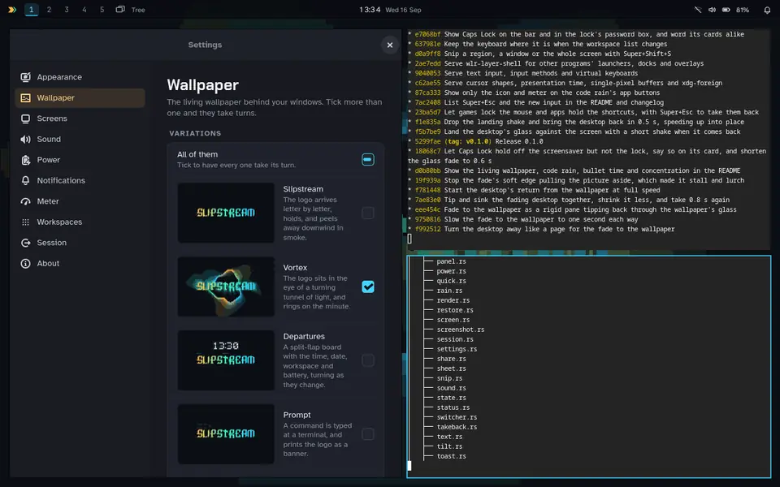
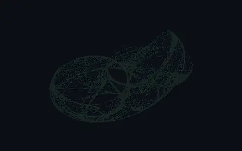
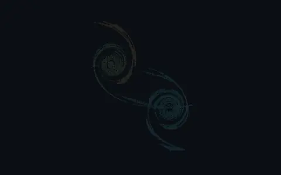
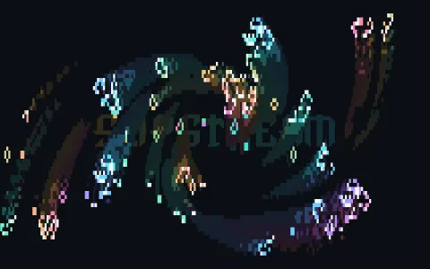
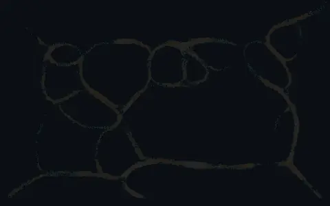
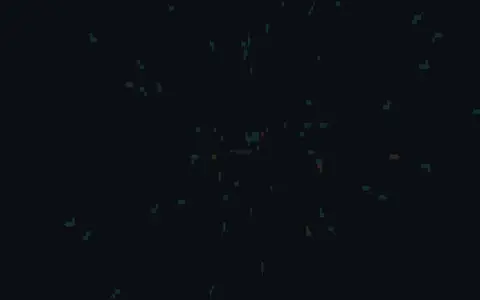
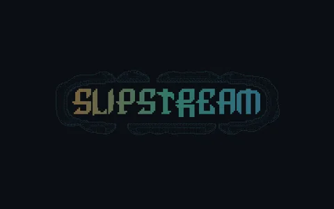
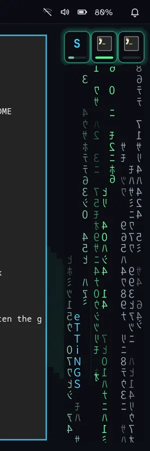
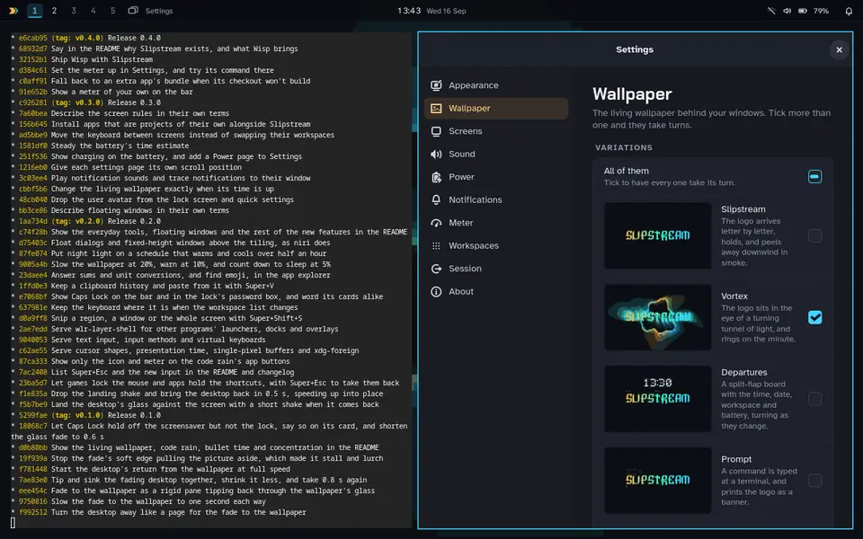
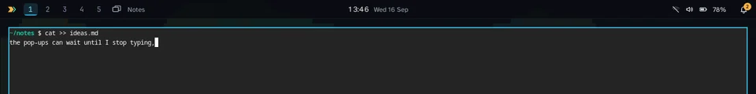

<div align="center">

# Slipstream

**A keyboard-first Wayland desktop for Linux that looks like nothing else and gets out of your way.**

Your wallpaper is a screensaver. Minimised windows turn into digital rain.<br>
Bullet time slows the whole desktop down. Pop-ups wait until you stop typing.

[](https://github.com/peterwalker78/slipstream-desktop/actions/workflows/ci.yml)
[](https://github.com/peterwalker78/slipstream-desktop/releases)
[](LICENSE)



<sub>Recorded from Slipstream itself: the desktop fading into its living wallpaper, and one key bringing it back.</sub>

[**Install**](#installing) · [**Keys**](#keys) · [**Changelog**](CHANGELOG.md)

</div>

Slipstream is a whole desktop session: its own compositor, bar, notifications, lock screen and Settings app, written in Rust on [Smithay](https://github.com/Smithay/smithay). It tiles, it's built for the keyboard and uses common shortcut key combos so you don't have to fight muscle memory from other Operating Systems. It installs next to your current desktop, so you can pick it at the login screen and go back whenever you like.

## The wallpaper *is* the screensaver

There's no separate screensaver to wait for. A living wallpaper runs behind your windows all the time, and when you step away, the windows and the bar fade out through a glass transition and leave it the whole screen. Touch a key and everything comes back the same way. That key only wakes the desktop, so nothing gets typed blind.

There are **twenty** of them, and many aren't canned animations at all but real simulations seeded from the logo: strange attractors, colliding galaxies, slime mould, reaction–diffusion, flocking starlings, growing frost. A few favourites:

<table>
<tr>
<td align="center"><br><b>Attractor</b><br><sub>The logo unravels into a strange attractor, then winds back into letters.</sub></td>
<td align="center"><br><b>Galaxies</b><br><sub>The logo's two halves become spiral galaxies that collide, then run backwards.</sub></td>
<td align="center"><br><b>Life</b><br><sub>Conway's Game of Life, seeded with the logo, glowing and swirling to a beat.</sub></td>
</tr>
<tr>
<td align="center"><br><b>Physarum</b><br><sub>A slime mould creeps out of the letters and spreads over the screen as veins.</sub></td>
<td align="center"><br><b>Warp</b><br><sub>A steering tunnel of streaks, with the logo coming up out of the vanishing point.</sub></td>
<td align="center"><br><b>Coral</b><br><sub>The letters seed a chemical reaction that grows over the screen, then dies back.</sub></td>
</tr>
</table>

<details>
<summary><b>All twenty wallpapers</b></summary>

| | |
|---|---|
| **Slipstream** | The logo arrives letter by letter, holds, and peels away downwind in smoke. |
| **Vortex** | The logo sits in the eye of a turning tunnel of light, and rings on the minute. |
| **Departures** | A split-flap board with the time, date, workspace and battery, turning as they change. |
| **Prompt** | A command is typed at a terminal, and prints the logo as a banner. |
| **Circuit** | Tracks are routed in from the edges, and pulses run along them to the logo. |
| **Life** | Conway's Game of Life, seeded with the logo, with a spark dropped in when it settles. |
| **Sonar** | A beam sweeps round, and everything it touches answers and fades behind it. |
| **Tide** | Swell crosses the screen in shaded bands, and the logo surfaces out of it. |
| **Warp** | A steering tunnel of streaks, and the logo comes up out of its vanishing point. |
| **Glitch** | The picture smears like a broken video stream, then swirls away. |
| **Contours** | A pressure map of the air round the logo, with a weather system drifting across. |
| **Contrails** | Aircraft leave trails that light up the logo, and now and then skywrite the time. |
| **Coral** | The letters seed a chemical reaction that grows over the screen in stripes and spots, then dies back. |
| **Attractor** | The logo unravels into a strange attractor that slowly changes shape, then winds back into letters. |
| **Murmuration** | The logo takes off as a flock of starlings that wheels round the screen, scatters from a falcon, and lands back in the letters. |
| **Maze** | A walk through a maze, seen first hand, to the logo on the wall at its end. |
| **Physarum** | A slime mould creeps out of the letters, spreads over the screen as a network of veins, then draws back into the logo. |
| **Galaxies** | The two halves of the logo wind up into spiral galaxies that collide and merge, then the collision runs backwards into letters. |
| **Chladni** | The logo is sand on a ringing plate: each note shakes it into a new figure, and then it walks home. |
| **Frost** | Frost grows out of the letters in branching ferns, glitters, and melts back the way it came. |

</details>

Tick as many as you like in Settings → Wallpaper, which has moving previews, and they take turns. **Caps Lock turns the screensaver off:** while it's on, the desktop stays up, and so it does while something is fullscreen or a video player asks. Caps Lock doesn't hold off the screen lock, so a desktop left with it on still locks on time. The lock screen uses the living wallpaper too.

## Minimise into the Matrix



Press **Super+M** and the window doesn't vanish into a taskbar. It pours into a stream of digital rain at the edge of the screen, and keeps running there.

The rain is a live readout of that app. **An idle app's rain drifts down slow and grey. A busy one pours fast and bright green,** from its own CPU and memory use, so a build finishing or a tab running away shows up out of the corner of your eye. Each stream spells out its app's name as it falls.

It's built from xscreensaver's GLMatrix, the classic recreation of the film's effect, rather than random characters in a font. A click on a stream, or **Super+Shift+M**, brings the window back.

<br clear="right">

## Bullet time



**Super+Tab** tilts the whole desktop back into 3D, with every workspace laid out side by side and a letter on each window. Press the letter and you're there. Or move windows between workspaces, weigh them, minimise or close them from the overview.

While it's open, **everything the compositor draws drops to a quarter speed**: window animations, the rain, the wallpaper. When you leave, the clock catches back up to where it would have been, smoothly and with no jump.

## Concentration first



Most desktops let any app break your train of thought at any moment. Slipstream doesn't.

- **Notifications that arrive while you type wait for a natural pause**, then come up as one card. The bell counts them straight away, and Super+N shows them any time. Critical ones never wait, and nothing waits more than 15 minutes.
- **Windows you didn't ask for don't take the screen or the keyboard.** An app opening a window by itself, or a window from another app while you type, pours into the code rain with a toast instead. Windows you open yourself, dialogs of the app you're in, and anything that appears just after a click still come straight to you.
- **Typing is judged from when keys reach an app, never from which keys.** It ends at a pause of 15 seconds, a shortcut, a click, or a change of focus.

Settings → Notifications has the switches.

## Everyday tools, with a twist

The things you'd expect any desktop to do, each done the Slipstream way.

- **Snip, then watch it go.** **Super+Shift+S** freezes the screen: drag out a region, press the letter on a window, or Enter for the whole screen. The snip is saved and copied, and **the part you chose breaks into fragments that turn into rain glyphs and fly into the "saved" toast.**
- **Clipboard history that decodes.** **Super+V** lists the last 25 things you copied, text and pictures. **As you move through the list, each entry decodes out of rain glyphs into its text.** Enter pastes it into the app you're in. It's kept in memory only and forgotten at logout, and anything a password manager marks as secret is never kept.
- **An explorer that answers.** Type `12*7`, `15% of 80`, `5 km in miles` or `100f to c` into **Super+Space**, and the answer decodes into place, ready to copy. Type `:fire` and Enter types 🔥 into your app.
- **Floating windows that stay out of the way.** Dialogs open floating, centred over the window they belong to. Splash screens and picture-in-picture videos float too. **Super+Shift+V** floats or tiles any window, and **Super+Ctrl+V** moves the keyboard between the floating windows and the tiles. Floating windows move with their title bar or Super+drag.
- **A battery that looks after you.** Unplugged at 20%, **the living wallpaper visibly slows to half speed to save power.** At 5%, a card counts down a minute to sleep so your work survives in memory, and it ignores keys for its first moment, so nothing you're typing can answer it.
- **Night light that follows the sun,** with no location needed: sunset and sunrise are worked out from your time zone. **The screen warms over half an hour at dusk, the way the light outside does,** rather than all at once.
- **Caps Lock you can't miss:** an amber chip on the bar, and the Caps Lock arrow in the lock screen's password box.
- **Games and virtual machines behave.** Games can lock the mouse and virtual machines can take every key. **Super+Esc** always takes them back.

## Gravity

Tiling isn't all or nothing. **Super+T** turns gravity on, and **Super+PgUp** and **Super+PgDn** move the focused window along one ladder: *distant · orbit · grid · tiling · centre · wide · spotlight*. One rung per press, always reversible.

## And everything else a desktop needs

- **Tiling** across named workspaces (up to 20), several screens, a laptop lid that hands the workspace over to the external screen, fullscreen, and X11 apps through XWayland.
- **App explorer** (Super+Space or Super+R): every installed app, Flatpaks included, plus recent files, sums, unit conversions and emoji. Type a command that matches no app and Enter runs it, like Windows' Run box.
- **Alt+Tab**, Alt+F4, Super+arrows and the rest of the Windows keys you already know, with tiles moved and resized from the keyboard.
- **Bar and quick settings** (Super+A): clock and calendar, Wi-Fi, Bluetooth, volume, brightness, night light (on a schedule if you like), power mode. Media keys work with any player that speaks MPRIS.
- **Notifications** (Super+N): pop-ups with action buttons, sounds from your sound theme, a notification centre, do not disturb. Each notification knows the window it came from, even `notify-send` in a terminal, and opening it takes you there.
- **Lock screen** (Super+L), before sleep and optionally after a while idle.
- **Screenshots and snips** (Print, Super+Shift+S), saved to Pictures/Screenshots and copied.
- **Works with the wider Wayland world:** input methods (IBus, fcitx5) and on-screen keyboards, launchers and pickers that use layer shell (fuzzel, wofi, slurp), cursor themes by name, frame timing for smooth video, touchpad gestures, and pointer lock for games.
- **Screen sharing** through xdg-desktop-portal-wlr, with Slipstream's own picker for a whole screen or a single window, and a red pill on the bar that stops every share. It works end to end in testing, but is still new with real apps.
- **A gentle way out**: logging out asks apps to close and waits for them, and your layout can be reopened at the next login.
- **Settings** (Super+I): applied the moment you change them, and saved as plain text in `~/.config/slipstream/settings.toml`.
- **A meter of your own** beside quick settings, for any allowance a command can report: a quota, a plan's limits, a disk. See below.
- **Every effect has a reduced-motion version**, switched live from Settings.

**Status: beta.** Slipstream is developed and used as a daily desktop on Bazzite (Fedora Atomic). Expect rough edges, and changes between versions.

## Requirements

- Linux with **systemd-logind** or **seatd**, and a GPU whose driver supports GBM and EGL. Mesa (Intel, AMD) is what it's tested on.
- A display manager that lists Wayland sessions: Plasma Login, SDDM, GDM, LightDM, greetd or ly. Without one, start it from a text console with `slipstream --session`.
- Recommended, each for one feature: Xwayland, xdg-desktop-portal-wlr (screen sharing), WirePlumber and PipeWire tools (volume), NetworkManager (Wi-Fi), BlueZ (Bluetooth), power-profiles-daemon. `scripts/install-session --check` says what's missing on your system and how to get it.

Your existing desktop stays installed and on the login screen: Slipstream is added beside it.

## Installing

### From a release (Fedora 44, Bazzite, Aurora, Bluefin)

Releases carry ready-built programs for Fedora 44 and the systems built on it. On anything else, build from source.

Download the `.tar.gz` and its `.sha256` from the [releases page](https://github.com/peterwalker78/slipstream-desktop/releases), then:

```sh
sha256sum -c slipstream-0.2.0-fedora44-x86_64.tar.gz.sha256
tar xf slipstream-0.2.0-fedora44-x86_64.tar.gz
cd slipstream-0.2.0-fedora44-x86_64
scripts/install-session --check    # what it will do, and what's missing; writes nothing
scripts/update-session             # puts the programs in ~/.local/bin; no root
scripts/install-session            # adds Slipstream to the login screen; asks for sudo once
```

### From source

On an atomic system (Bazzite, Silverblue, Kinoite), build in a Fedora 44 distrobox called `slipstream`, which `update-session` uses when it's there:

```sh
distrobox create --name slipstream --image registry.fedoraproject.org/fedora-toolbox:44
distrobox enter slipstream -- sudo dnf install -y gcc clang mold rustup pkgconf-pkg-config \
    libxkbcommon-devel wayland-devel systemd-devel libinput-devel mesa-libgbm-devel \
    libseat-devel libdrm-devel mesa-libEGL-devel pixman-devel libdisplay-info-devel gtk4-devel
distrobox enter slipstream -- rustup-init -y
```

Then, from the host, in your clone:

```sh
scripts/update-session     # builds in the box (or with the cargo on your system) and installs
scripts/install-session    # once
```

### Then

Log out, choose **Slipstream** in the login screen's session menu, and log in. Super+/ shows every key.

### How the installer keeps your system safe

- **It checks everything first.** A refusal writes nothing, and it never installs packages.
- **It writes all or nothing.** Its few system files (the session entry, its launcher, the lock screen's PAM service and a manifest) are staged and moved into place together, so a failure part way changes nothing.
- **It leaves other files alone.** It never replaces or removes a file it didn't write.
- **Updates can't leave a broken program.** `update-session` checks the new programs run on your system before swapping them in.

### Apps of your own alongside it

Apps that go with your desktop but are projects of their own can be installed and kept up to date as Flatpaks by `update-session`, which runs `scripts/install-extras` after installing Slipstream. Describe each in a file in `~/.config/slipstream/extras/`, say `browser.conf`:

```sh
app_id=org.example.Browser
checkout=~/Projects/browser      # built with its own command whenever the checkout has new commits
build=scripts/flatpak
bundle_url=https://example.org/browser.flatpak       # used without a checkout, or if it fails to build before the app is installed
bundle_sha256_url=https://example.org/browser.flatpak.sha256
default_browser=yes              # set once, so choosing another browser later sticks
```

`scripts/install-extras --check` says what it would do and changes nothing; `--help` lists every key.

### A meter of your own

The bar can show how much of something is used, from any command that prints a small JSON report. Set it in **Settings → Meter**, where **Run it now** shows what the bar would show or why a command doesn't work, or in `~/.config/slipstream/settings.toml`:

```toml
[meter]
command = "quota-report --json"   # run with sh -c
every-secs = 60
```

The report has sections, each with meters:

```json
{"sections": [{"name": "Storage", "detail": "Pro",
               "meters": [{"label": "Daily", "percent": 42, "resets": 1790000000},
                          {"label": "Weekly", "percent": 18}],
               "note": null, "stale": false}]}
```

The bar shows a small gauge for each section: its first meter as the thick bar, with the percentage beside it, and its second as the thin bar underneath. The gauge turns amber at 75% and orange at 90%. Quick settings lists every meter, with the time left until each starts over (`resets` is in seconds since the Unix epoch). `detail`, `note`, `stale` and `resets` are optional. A section marked `stale` is dimmed, and so is everything if the command fails, times out after 30 seconds, or prints something unreadable. The last good report stays on show in the meantime.

## Updating

Pull or download the new version, run `scripts/update-session`, and log back in. Run `scripts/install-session` again too when the changelog mentions the installer or the session files; it's safe to run any time.

## Uninstalling

From another desktop:

```sh
scripts/install-session --uninstall           # the session, the programs, their units and portal settings
scripts/install-session --uninstall --purge   # and your Slipstream settings, log and saved layout
```

Packages you added for it stay, since other things may use them.

## Keys

| Keys | What they do |
|---|---|
| Super+Space, Super+R | App explorer |
| Super+Return, Super+E, Super+I | Terminal, files, Settings |
| Alt+Tab, Alt+Shift+Tab | Switch windows |
| Alt+F4 | Close the window |
| Super+arrows | Move focus |
| Super+Alt+arrows | Move the tile |
| Super+[ and ], with Shift for height | Resize |
| Super+F | Fill the screen, and back |
| Super+M, Super+Shift+M | Minimise to the code rain, bring back |
| Super+Shift+V, Super+Ctrl+V | Float the window or tile it; switch between floating and tiled windows |
| Super+D | Show the desktop, and back |
| Super+Tab | Bullet time |
| Super+T, Super+PgUp, Super+PgDn | Gravity on or off, heavier, lighter |
| Super+1–9, Super+Ctrl+← → | Go to a workspace |
| Super+Shift+1–9, Super+Shift+← → | Move the window to a workspace |
| Super+P, Super+Shift+P | Next screen, move the window there |
| Super+A, Super+N | Quick settings, notifications |
| Super+V | Clipboard history |
| Print, Super+Shift+S | Screenshot of the screen; snip a region or a window |
| Super+L | Lock |
| Super+Esc | Take the mouse and keys back from a game or virtual machine holding them |
| Caps Lock | Keeps the screensaver off while it's on (the screen still locks) |
| Super+Shift+Esc | Log out |
| Super+/ | Every key |

Ctrl+Alt+F1–F12 switch virtual terminals as usual. Keys that input methods, screen readers and games rely on are left alone.

## Troubleshooting

- **Back at the login screen straight away:** read `~/.local/state/slipstream/slipstream.log` (the previous session's is `slipstream.log.old`).
- **Super+L doesn't lock:** run `scripts/install-session`, which installs the lock screen's PAM service.
- **Screen sharing offers nothing:** install xdg-desktop-portal-wlr, run `scripts/update-session`, and log in again.
- **Anything else:** `scripts/install-session --check` reports what the system is missing.

## Development

| Path | What it is |
|---|---|
| `slipstream/` | The compositor (Rust and [Smithay](https://github.com/Smithay/smithay)) |
| `slipstream-settings/` | The Settings app (GTK 4) |
| `slipstream-config/` | The settings file both of them share |
| `session/` | The login session's launcher, entry, systemd targets and portal settings |
| `scripts/` | Installing, updating, packaging, and running nested |

```sh
scripts/nested              # builds in the box and opens foot inside Slipstream, as a window
scripts/nested firefox      # or another program
cargo test --workspace      # in the box
scripts/test-install-session
```

Nested, **Alt is the Mod key**, since your desktop keeps Super for itself.

## Principles

- No telemetry, ever.
- No AI in the desktop. Slipstream has no AI features and none are planned.
- Keybindings never take keys that input methods, screen readers, games or apps rely on.
- Works with logind or seatd through libseat.
- Every effect has a reduced-motion version.

AI coding tools are used in writing Slipstream's code. Every change is built and tested in CI.

## Licence

GPL-3.0-or-later. See `LICENSE`. Parts of the compositor started from Smithay's `smallvil` example (MIT). The fonts are under the SIL Open Font Licence; their licences are in `assets/fonts`.
