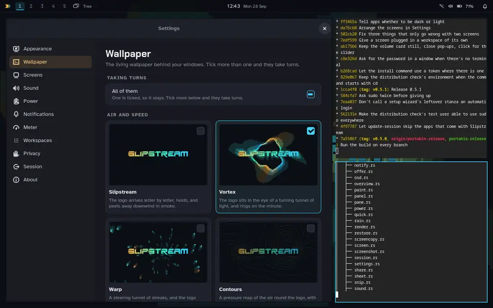
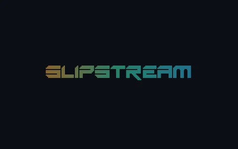
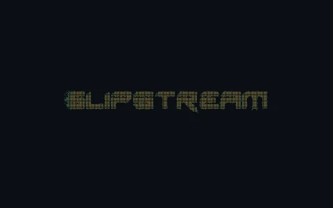
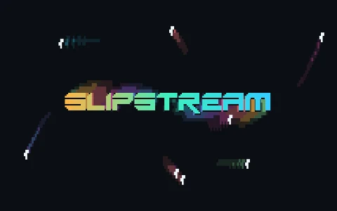
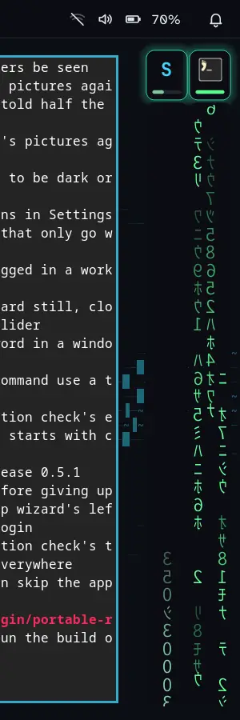
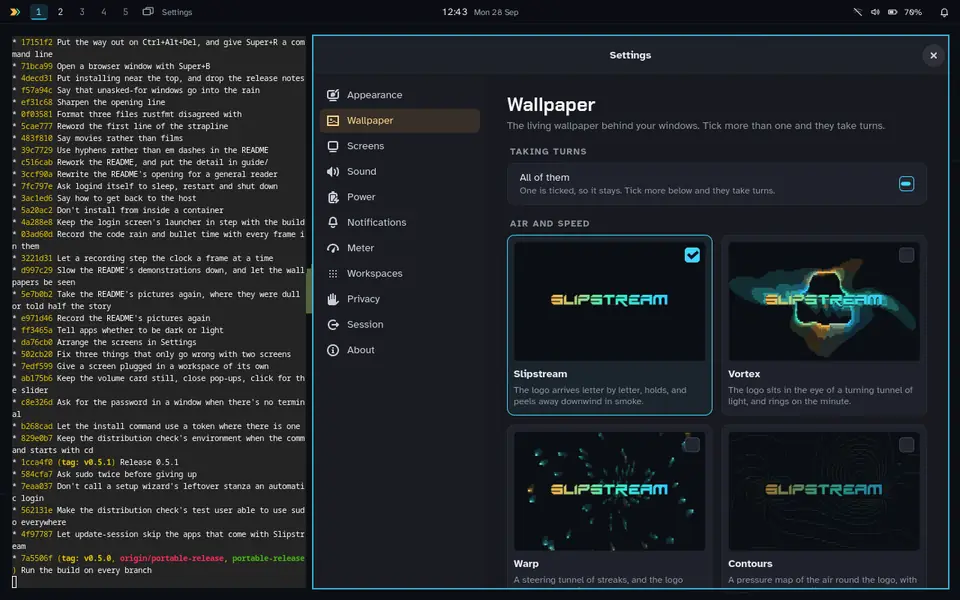
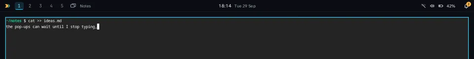
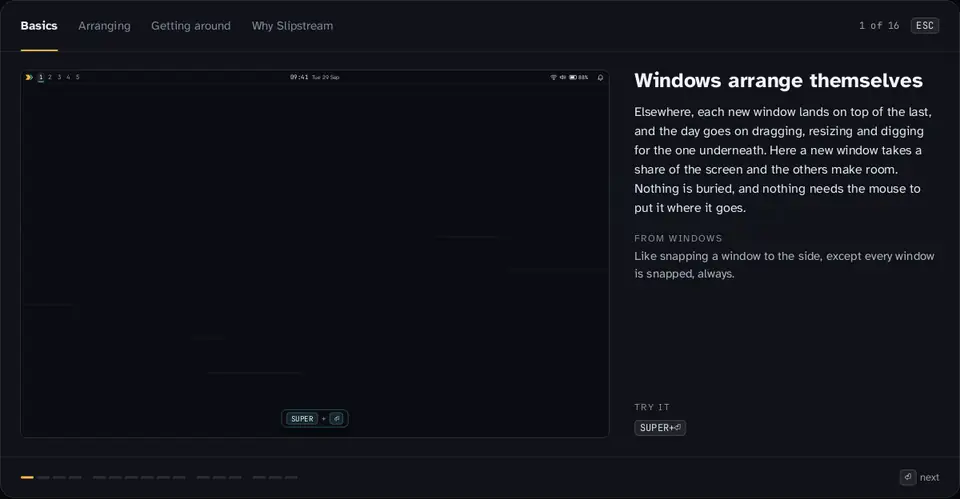
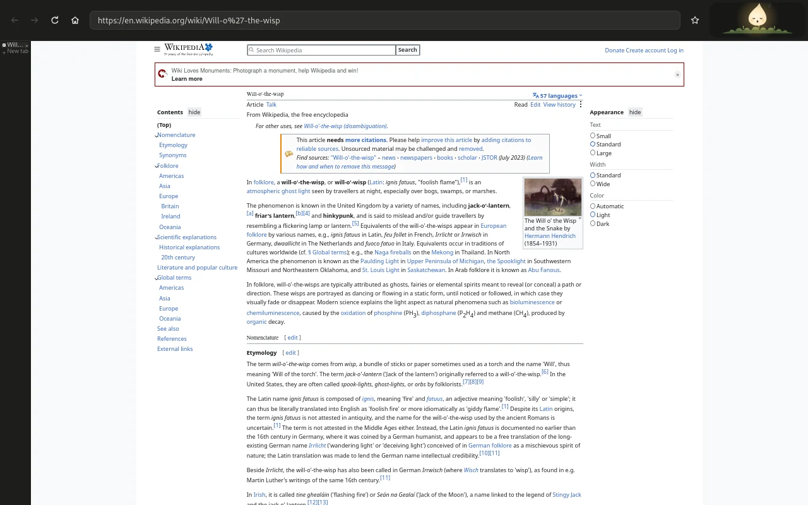
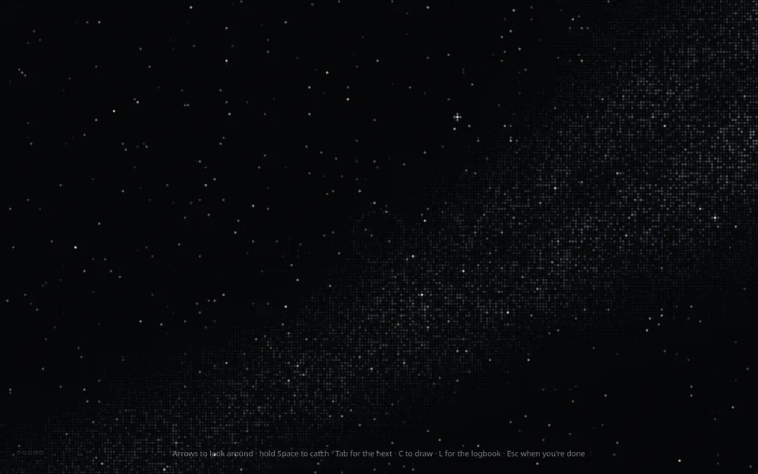

<div align="center">

<picture>
  <source media="(prefers-color-scheme: dark)" srcset="assets/readme/wordmark-dark.svg">
  
</picture>

**The Linux desktop the movies promised.**

A keyboard-first tiling desktop for Linux: its own Wayland compositor, bar, notifications, lock screen and Settings,<br>
in one download that installs beside the desktop you have.

Windows that pour away into digital rain. Wallpapers that come alive when you step away.<br>
Nothing that interrupts you, and nothing that leaves your machine.

[](https://github.com/peterwalker78/slipstream-desktop/actions/workflows/ci.yml)
[](https://github.com/peterwalker78/slipstream-desktop/releases)
[](LICENSE)



<sub>Recorded from Slipstream itself: the desktop fading into its living wallpaper, and one key bringing it back.</sub>

[**Get it**](#get-slipstream) · [**Questions**](#questions) · [**Every key**](guide/keys.md) · [**Help**](guide/help.md)

</div>

## Why Slipstream exists

Films always showed computers the way they could feel: screens of falling code, one key that does something enormous, someone who never reaches for the mouse. That last part is the one the films got right. The people who look like wizards on screen are just people who do everything from the keyboard.

Most screens now are built to keep you checking one more thing. **Slipstream is a workshop, not a slot machine.** Good-looking enough that you want to sit down at it, quiet enough that you get lost in the work instead of the machine, and everything a keystroke away. It's a whole desktop with nothing to assemble, free and open source, and it sits beside the one you use now: pick it at the login screen, and go back whenever you like.

## Your wallpaper is alive

<table>
<tr>
<td align="center"><br><b>Galaxies</b><br><sub>Two galaxies collide, then the collision runs backwards.</sub></td>
<td align="center"><br><b>Physarum</b><br><sub>A slime mould creeps out over the screen in amber veins.</sub></td>
<td align="center"><br><b>Life</b><br><sub>Conway's Game of Life, glowing and swirling to a beat.</sub></td>
</tr>
</table>

Step away from your desk and the desktop dissolves and hands over the screen. There's no screensaver waiting to kick in - the wallpaper was running behind your windows the whole time.

**There are twenty, and most of them aren't animations at all.** They're worked out live as you watch, so they never run quite the same way twice. Touch any key and your work comes straight back, exactly as you left it.

[**All twenty →**](guide/wallpapers.md)

## Windows fall into the Matrix



Put a window away and it pours down the side of the screen as a stream of falling green code, and carries on running there.

**The rain is a readout.** A busy app races, bright green. A quiet one drifts down slowly in grey. So a build finishing, or a tab running away with itself, catches your eye without you going to look for it.

**Pop-ups you never asked for are sent there too.** An app that opens a window by itself, or throws one in front of you while you're typing, pours straight into the rain instead of taking the screen, with a quiet toast to say what happened. Windows you opened yourself, dialogs belonging to the app you're in, and anything that appears just after a click still come to you as normal.

Each stream spells out its app's name as it falls. Click one to bring the window back.

Prefer something calmer? Settings swaps the code for [streaks of falling light](guide/features.md#the-code-rain-in-full).

<br clear="right">

## Bullet time



One shortcut tips the whole desktop back into the distance, with every window you have open laid out in front of you - and everything on screen drops to a quarter of its speed while you're looking. Press the letter on a window to land on it, or move windows between workspaces from up there.

## Nothing interrupts you



Slipstream puts your concentration first.

- **Pop-ups wait until you pause for breath,** then arrive together as a single card. Urgent ones never wait, and nothing waits more than 15 minutes.
- **Windows you didn't ask for can't barge in front of your work** or run off with your keyboard. They pour into the code rain instead, with a quiet toast to say so.
- **Slipstream can tell that you're typing, so it knows not to interrupt you** - but never what you're typing.

## New to tiling? Take the tour



Press Super+/, then Enter. Sixteen short lessons take you from what tiling is, and why it beats piling windows on top of each other, through arranging and getting around, to the ideas Slipstream is built on. Each one says why before what to press, and plays out on a miniature of your own desktop with the key lighting up as it goes down. Press a lesson's keys to try the move right there - it plays on the miniature, never on your real windows.

## Get Slipstream

One command. It downloads the newest release, checks it against its published checksum, and says what it will do before it writes anything:

```sh
sh -c "$(curl -fsSL https://raw.githubusercontent.com/peterwalker78/slipstream-desktop/main/install.sh)"
```

Then log out and choose **Slipstream** on the login screen. Tap Super for your apps, Super+Enter for a terminal, Super and the arrows to move around, Super+Tab for bullet time, and Super+/ for every key and the tour.

- **Look first.** Add `-- --try` to the end and it opens in a window on the desktop you're using now, installing nothing. `-- --check` says what it would do and writes nothing.
- **Check it.** Read [`install.sh`](install.sh) before you run it, or confirm a download was built here: `gh attestation verify slipstream-*.tar.gz --repo peterwalker78/slipstream-desktop`.
- **Two companion apps come with it,** Glimmerwood and Westering, as Flatpaks. From the next release the installer asks about each one first.
- **Take it away** with the same command and `-- --uninstall`. It removes exactly what it wrote.

**You'll need** an x86_64 machine with Debian 13's libraries or newer (Ubuntu 24.04 and Linux Mint 22 aren't there yet), and graphics with working Mesa drivers. NVIDIA's driver hasn't been tried. Screen sharing needs xdg-desktop-portal-wlr 0.8 or newer.

**Status: beta (0.8).** Every release is installed and started on Debian, Ubuntu, Fedora, Arch and openSUSE. Not yet: ARM machines, Ubuntu 24.04 and the distributions built on it, and packages in distributions' own repositories. Expect changes between versions; the [changelog](CHANGELOG.md) says what's new in each.

[**What you need, every other way to install it, which distributions it runs on, and building from source →**](guide/install.md)

## Everything else you'd expect

- **Snip, then watch it go.** Freeze the screen, drag out a region, and the part you chose shatters into rain glyphs that fly into the "saved" toast.
- **Windows are panes of glass.** Alt+Tab deals them as a deck receding into depth, and two tiles swapped with Super+Alt+arrows pass through each other.
- **A clipboard that decodes.** The last 25 things you copied, each unscrambling out of glowing characters into readable text as you reach it.
- **An explorer that answers.** Type `15% of 80`, `5 km in miles` or `:fire` and get an answer rather than a search.
- **Tiling that isn't all or nothing.** Hold Super+T and pick an arrangement - grid, centre, wide, spotlight - from pictures of your own windows, which move as you choose.
- **A battery that looks after you.** At 20% the wallpaper slows to half speed to save power; at 5% you get a minute's warning and then sleep, so your work survives.
- **Night light that follows the real sun,** warming the screen over half an hour at dusk rather than all at once.
- **A screen that stays on when you want it to.** Hold Caps Lock for Awake: the desktop won't fade or lock by itself until you hold it again. A tap is still Caps Lock.
- **Games and virtual machines behave.** They can hold the mouse and every key, and one shortcut always takes it back.
- **A meter of your own on the bar,** for any allowance a command can report: a quota, a plan's limits, a disk.
- **The Linux tools you already have keep working.** Screenshot and recording tools like `grim` and `wf-recorder`, idle tools, colour-temperature tools - and nothing records your screen without asking you first, by name.

[**The full list →**](guide/features.md) · [**Every key →**](guide/keys.md)

## What we won't do

- No telemetry, ever. What you do on your computer stays on your computer.
- Nothing in Slipstream is built to keep you looking at it for longer than you meant to.
- No AI features, ever.
- Keybindings never take keys that input methods, screen readers, games or apps rely on.
- Every effect has a reduced-motion version, switched live from Settings.

## Questions

**Is it a whole desktop?** Yes: compositor, bar, notifications, lock screen, app explorer and a Settings app, with nothing to put together yourself. Settings are kept in plain text, in `~/.config/slipstream/settings.toml`.

**Is it built on another compositor?** No. It's a Wayland compositor of its own, written in Rust with the [Smithay](https://github.com/Smithay/smithay) library.

**Will it change the desktop I have?** No. It's added to the login screen beside it, and uninstalling removes exactly what the installer wrote.

**Will my apps run?** Wayland apps, X11 apps through XWayland, Flatpaks and games all do. Screenshot and recording tools like `grim` and `wf-recorder` keep working too.

**Does it phone home?** No. There's no telemetry, and it never checks for updates by itself.

**What doesn't work yet?** ARM machines, Ubuntu 24.04 and the distributions built on it, and screen sharing where xdg-desktop-portal-wlr is older than 0.8. NVIDIA's driver hasn't been tried. If something else doesn't work, [say so in an issue](https://github.com/peterwalker78/slipstream-desktop/issues).

## Companions

<table>
<tr>
<td width="50%" valign="top"><a href="https://github.com/peterwalker78/glimmerwood"></a><br><b><a href="https://github.com/peterwalker78/glimmerwood">Glimmerwood</a></b>, a quiet, lightweight browser. Its wisp, a small flame in the toolbar, brightens when you read, learn or make something, and grows sleepy in an endless feed. It never blocks or nags.</td>
<td width="50%" valign="top"><a href="https://github.com/peterwalker78/westering"></a><br><b><a href="https://github.com/peterwalker78/westering">Westering</a></b>, for the end of the day: a few quiet minutes under tonight's real sky, drawn in the same fine dots as the wallpapers, to set down what's on your mind. It has no network access at all.</td>
</tr>
</table>

Both are projects of their own that run on any Linux desktop. The installer adds them as Flatpaks; Super+B opens a new window of whichever browser you've made your default.

## Help and detail

| | |
|---|---|
| [**Installing**](guide/install.md) | what you need, every install route, which distributions, updating, uninstalling, building from source |
| [**Every key**](guide/keys.md) | the whole table - Super+/ shows it in the desktop too |
| [**Help**](guide/help.md) | when something goes wrong, a program asking to record your screen, the bar's meter, and apps that come with your desktop |
| [**The living wallpapers**](guide/wallpapers.md) | all twenty, and how they behave |
| [**Everything a desktop needs**](guide/features.md) | the full feature list |
| [**Working on Slipstream**](guide/development.md) | the workspace, and running it nested |

AI coding tools are used in writing Slipstream's code. Every change is built and tested in CI.

## Licence

GPL-3.0-or-later. See [`LICENSE`](LICENSE). Parts of the compositor started from Smithay's `smallvil` example (MIT). The code rain is built from xscreensaver's GLMatrix. The fonts are under the SIL Open Font Licence; their licences are in `assets/fonts`.
