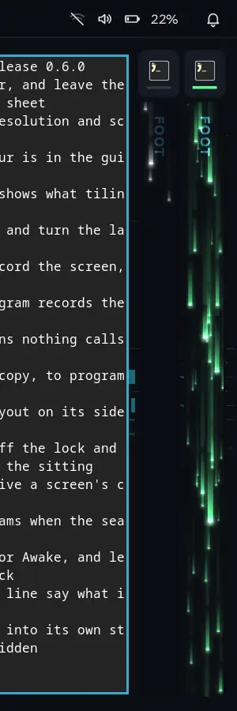
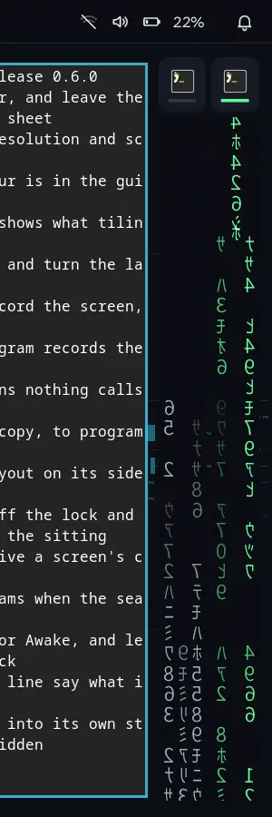
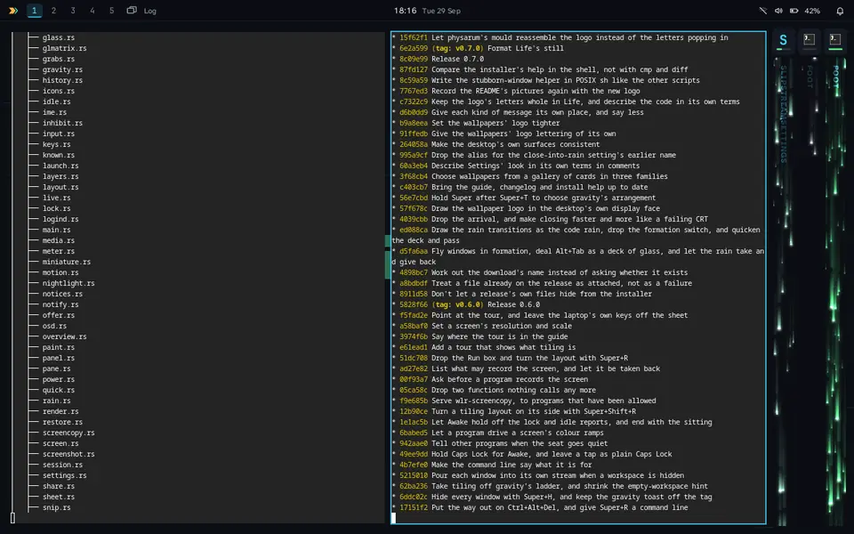

# Everything a desktop needs

The detail the README doesn't stop for. Every keystroke mentioned here is in [the key list](keys.md).

[← back to the README](../README.md)

## Everyday tools, in full

The things you'd expect any desktop to do, each done the Slipstream way.

- **Snip, then watch it go.** **Super+Shift+S** freezes the screen: drag out a region, press the letter on a window, or Enter for the whole screen. The snip is saved and copied, and **the part you chose breaks into fragments that turn into rain glyphs and fly into the "saved" toast.**
- **Clipboard history that decodes.** **Super+V** lists the last 25 things you copied, text and pictures. **As you move through the list, each entry decodes out of rain glyphs into its text.** Enter pastes it into the app you're in. It's kept in memory only and forgotten at logout, and anything a password manager marks as secret is never kept.
- **An explorer that answers.** Type `12*7`, `15% of 80`, `5 km in miles` or `100f to c` into the explorer (**tap Super**), and the answer decodes into place, ready to copy. Type `:fire` and Enter types 🔥 into your app.
- **Floating windows that stay out of the way.** Dialogs open floating, centred over the window they belong to. Splash screens and picture-in-picture videos float too. **Super+Shift+V** floats or tiles any window, and **Super+Ctrl+V** moves the keyboard between the floating windows and the tiles. Floating windows move with their title bar or Super+drag.
- **A battery that looks after you.** Unplugged at 20%, **the living wallpaper visibly slows to half speed to save power.** At 5%, a card counts down a minute to sleep so your work survives in memory, and it ignores keys for its first moment, so nothing you're typing can answer it. On a charger the icon turns mint with a bolt through it, and Settings → Power has the whole story, from charge limit to battery health.
- **A meter for whatever you're counting.** A small gauge beside quick settings shows how much of something you've used, from any command you choose: a quota, a plan's limits, a disk. It warms to amber at 75% and orange at 90%, and quick settings shows exactly when each allowance starts over. **Settings → Meter** runs your command on the spot and tells you what the bar will show, or exactly why it won't.
- **Night light that follows the sun,** with no location needed: sunset and sunrise are worked out from your time zone. **The screen warms over half an hour at dusk, the way the light outside does,** rather than all at once.
- **Caps Lock you can't miss:** an amber chip on the bar, and the Caps Lock arrow in the lock screen's password box.
- **Awake keeps the screen on.** Hold Caps Lock and the desktop stays up and doesn't lock by itself, with an AWAKE chip on the bar to say so. Hold it again, or click the chip, to turn it off; it also ends when you lock, sleep or shut the lid. A tap is still plain Caps Lock.
- **Games and virtual machines behave.** Games can lock the mouse and virtual machines can take every key. **Super+Esc** always takes them back.

## Gravity

Slipstream has two ways of laying out a workspace. In **tiling**, windows go where you put them. Under **gravity**, the windows place themselves around the one that matters: in a grid, or with it in the centre, wide or in the spotlight, and the rest in orbit or down in a strip along the bottom.

A quick **Super+T** switches between the two. Keep Super held and the choices appear side by side, drawn from your own windows: tiling on its own, and gravity's four arrangements after it. Tap T or use the arrows to move along them, and the windows follow as you go. Let go of Super to keep one, or press Esc to put things back. The next quick Super+T switches to the arrangement you kept.

The same keys work in both, meaning what they mean there:

- **Super+[ and ]** resize a tile in tiling. Under gravity a window's size is its weight: heavier gives it more of the screen, lighter sends it into orbit around another window or down to the strip.
- **Super+Alt+arrows**, or dragging with Super held, swap a window with the one that way. Under gravity the places keep their roles, so moving a window into the centre makes it the centre.
- **Super+F** fills the area with the window, and back, in either.
- **Super+R** turns a tiling layout a quarter, every window going with it, and Super+Shift+R turns it back. That one is tiling's alone.

## The streams, in full

<table align="right">
<tr>
<td align="center"> Slipstream</td>
<td align="center"> Code rain</td>
</tr>
</table>

Press **Super+M** and the window pours into a stream at the edge of the screen, under its app's icon, and keeps running there.

The stream is a live readout of that app: how hard it is working its processor, how fast its memory is changing and how much it is sending and receiving, whichever is busiest. Traffic by itself never fills the readout: a download at full speed reads as busy, a little over half way. An app that holds a lot and does nothing reads as idle, and a job that has just finished takes a few seconds to wind down. **Streaks of light fall at different depths, near ones wider, brighter and faster; an idle app sends a few slow grey ones, and a busy one pours bright green,** so a build finishing or a tab running away shows up out of the corner of your eye. The app's name runs down the card on its side like a book's spine, barely there while it's idle and glowing as the light passes. A click on a stream, or **Super+Shift+M**, brings the window back.

**Dock one to the bar.** **Super+W** sends the window you're in up to the bar, where it hangs at the top right as a pane of glass, in front of your windows and on every workspace. In the bar, beside the tray, is its stream, laid on its side: the same light a minimised window has, streaks or code rain as you've chosen, running along a short strip with the app's name in it, greener and faster the harder the app is working. Press it again for the next of three sizes, the largest a quarter of the screen. **Super+Shift+W** brings it back down as a standard window. It keeps the keyboard as it goes up. Super+arrows take the keyboard back to your tiles; Super+Up from the top row, Alt+Tab or a click on its strip puts it back in the pane. Docking a second window swaps the two. In bullet time the pane stays where it hangs and has a letter of its own, so it is chosen like any other window.

**Settings → Appearance → Effects** offers the code rain instead: falling green code rebuilt from xscreensaver's GLMatrix, the classic recreation of the film's effect, rather than random characters in a font. The same readout holds, and each stream spells out its app's name as it falls.

 

**Closing works the same way.** Close a window and it drops while a shower of streaks of light pours down through it, eating it away from the top; with the code rain, it's read out into falling code. Either way it goes with the scanlines and flicker of a failing CRT.

## Bullet time, in full

**Super+Tab** tilts the whole desktop back into 3D, with every workspace laid out side by side and a letter on each window. Press the letter and you're there. Or move windows between workspaces, weigh them, minimise or close them from the overview.

While it's open, **everything on screen drops to a quarter of its speed**: window animations, the rain, the wallpaper. When you leave, the clock catches back up to where it would have been, smoothly and with no jump.

## Concentration, in full

Most desktops let any app break your train of thought at any moment. Slipstream doesn't.

- **Notifications that arrive while you type wait for a natural pause**, then come up as one card. The bell counts them straight away, and Super+N shows them any time. Critical ones never wait, and nothing waits more than 15 minutes.
- **Windows you didn't ask for don't take the screen or the keyboard.** An app opening a window by itself, or a window from another app while you type, pours into a stream at the edge with a toast instead. Windows you open yourself, dialogs of the app you're in, and anything that appears just after a click still come straight to you.
- **Slipstream knows you're typing because keys are arriving somewhere, never because of which keys they are.** You count as typing until you pause for 15 seconds, use a shortcut, click, or move to another window.

Settings → Notifications has the switches.

## And everything else

Slipstream is a complete desktop session of its own, written in Rust on [Smithay](https://github.com/Smithay/smithay): compositor, bar, notifications, lock screen and Settings app.

- **Tiling** across named workspaces (up to 20), several screens, a laptop lid that hands the workspace over to the external screen, fullscreen, and X11 apps through XWayland.
- **App explorer** (tap Super): every installed app, Flatpaks included, plus recent files, sums, unit conversions and emoji. Type a command that matches no app and Enter runs it.
- **A tour** (Super+/, then Enter) for anyone new to tiling, in sixteen short lessons and four parts: the basics, arranging, getting around, and why Slipstream. Each lesson says why the desktop works the way it does before what to press, with a note for hands that know Windows, and plays out on a miniature of the desktop with its bar, apps that look like apps, your ring colour and your chosen effects. A lesson's own keys play its move on the miniature, never on your real windows.
- **Hide everything** (Super+H): every window on the workspace pours into a stream at once, and the same windows come back on the next press. Windows' "minimise all", where Super+M is one window.
- **The way out** (Ctrl+Alt+Del): lock, log out, restart or shut down, on one card. Every app is asked to close first and waited for, and anything that doesn't close is named. Your layout can be reopened at the next login.
- **Alt+Tab** deals your windows as a deck of glass panes, each Tab sending the front one round to the back; with reduced motion it's a flat card. Alt+F4, Super+arrows and the rest of the Windows keys you already know work too, with tiles moved and resized from the keyboard. Two tiles swapped with Super+Alt+arrows pass through each other.
- **Bar and quick settings** (Super+A): clock and calendar, Wi-Fi, Bluetooth, volume, brightness, night light (on a schedule if you like), power mode. Media keys work with any player that speaks MPRIS.
- **Notifications** (Super+N): pop-ups with action buttons, sounds from your sound theme, a notification centre, do not disturb. Each notification knows the window it came from, even `notify-send` in a terminal, and opening it takes you there.
- **Lock screen** (Super+L), before sleep and optionally after a while idle.
- **The screens turn off when nobody's there:** after 15 minutes with no input (Settings → Session), and a minute after the lock screen comes up. Awake, a fullscreen window or a playing video holds it off; any key or movement lights them again.
- **Screenshots and snips** (Print, Super+Shift+S), saved to Pictures/Screenshots and copied.
- **Screens** (Settings → Screens): resolution, refresh rate and scale per screen, and where each one sits so the pointer and Super+arrows cross between them the way they really are on your desk. A screen is remembered by what it reports about itself, so moving it to another port keeps its settings.
- **Works with the wider Wayland world:** input methods (IBus, fcitx5) and on-screen keyboards, launchers and pickers that use layer shell (fuzzel, wofi, slurp), cursor themes by name, frame timing for smooth video, touchpad gestures, and pointer lock for games.
- **And with the tools you already have:** screenshot and screen-recording tools that speak `wlr-screencopy` (`grim`, `wf-recorder` and the scripts built on them), idle tools (`swayidle`), and colour-temperature tools (`wlsunset`, `gammastep`), which Slipstream's own night light steps aside for while they are running. Tools that need dmabuf, `wl-screenrec` among them, don't work yet.
- **Nothing records your screen without being asked.** A program that asks puts up a card naming it, with "just this once" or "always allow". What has been allowed is listed in Settings → Privacy, where an answer can be taken back.
- **Dark or light, chosen in Settings**, and every app that asks the desktop follows it the moment you change it: GTK and Qt apps, browsers and anything packaged as a Flatpak. Slipstream's own bar, panels and windows are dark either way.
- **Screen sharing** through xdg-desktop-portal-wlr, with Slipstream's own picker for a whole screen or a single window, and a red pill on the bar that stops every share. It works end to end in testing, but is still new with real apps.
- **Settings** (Super+I): applied the moment you change them, and saved as plain text in `~/.config/slipstream/settings.toml`.
- **A meter of your own** beside quick settings, for any allowance a command can report: a quota, a plan's limits, a disk. [How to set it up](help.md#the-meter-on-the-bar).
- **Close into the rain:** a closing window drops towards the bottom of the screen as a shower of streaks of light pours down through it faster than it falls, eating it away from the top along a ragged, glowing edge; with the code rain, it's read out into falling code. Both go with the scanlines and flicker of a failing CRT. Settings → Appearance turns it off; off, or with reduced motion, a closing window simply fades.
- **Every effect has a reduced-motion version**, switched live from Settings.

